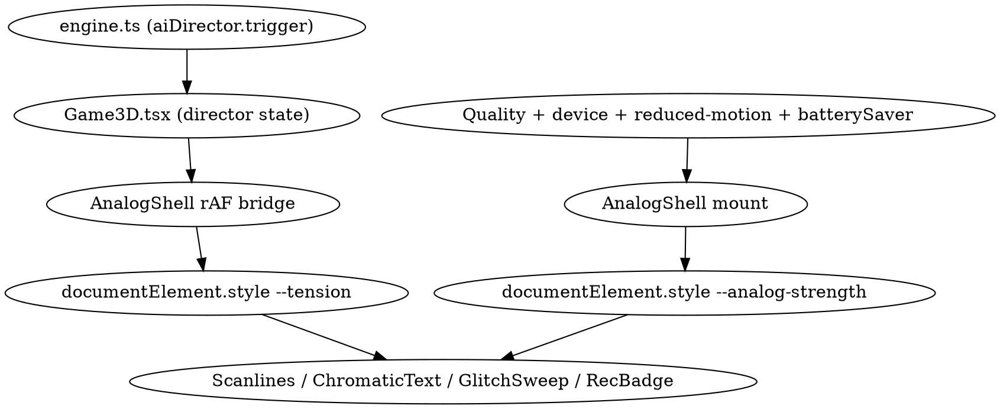

# Analog UI Shell — Design Spec

**Date:** 2026-05-08
**Author:** brainstorming session, Keith + Claude
**Sub-project:** 2D shell polish (first of three planned visual sub-projects: 2D shell → in-game 3D atmosphere → marketing surface)
**Status:** Draft, awaiting user review

## Goal

Give the React/Tailwind 2D shell of *Hunted by Claude* — title, loading, pause, HUD, mobile controls, gates, NotFound — a single coherent visual language that reads as **found-footage analog horror** and reacts to the in-game tension signal during play. The 3D world surface is out of scope; this spec only touches the React overlay and JSX inside `client/src/`.

The visual personality is **A — Found-Footage Analog**: VHS scanlines, chromatic split, magenta/cyan offsets, REC overlays, monospace data readouts. Effects are **reactive**: subtle by default, intensifying with the AI Director's tension score during gameplay, and gated by graphics quality / device class / reduced-motion preference.

## Why this scope, in this order

- The 3D world has just absorbed a heavy batch (procedural textures PR #58, walls/decals/fixtures, lighting hotfix). Touching it again risks colliding with stuff still settling.
- The 2D shell is what every player sees before, during, and after play. It carries perceived production quality more than any single 3D detail.
- It's tractable as one spec — 9 React files plus one engine bridge.

## Non-goals (YAGNI)

- 3D scene visual changes (sub-project B, deferred).
- Marketing/landing page outside the SPA (sub-project C; doesn't exist yet).
- New custom web fonts, downloaded asset packs, audio cues for UI events.
- Refactor of shadcn/ui Radix primitives in `components/ui/`.
- Server-side / Anthropic taunt UI changes.
- Internationalization of new UI strings.

## Architecture

**Choice:** CSS-variable theme + thin React component layer.

The AI Director's tension score (`DirectorUpdate.tension`, 0..1) is written to a single CSS custom property `--tension` on `document.documentElement` via a `requestAnimationFrame`-throttled bridge. Every analog visual effect derives its strength from `calc()` expressions over that variable. Quality and device class produce a separate `--analog-strength` multiplier set once on mount. Effective intensity in any element is `var(--tension) * var(--analog-strength)`.

This avoids React re-renders on tension change — CSS owns the animation. It also lets non-game surfaces (TitleScreen, NotFound) opt out of the live signal by passing a `staticTension` prop to `<AnalogShell>`, which simply writes a fixed value to the same variable so the same components render correctly with no engine attached.



## Module layout

New files under `client/src/ui/analog/`:

```
client/src/ui/analog/
  tokens.css          CSS variables — palette, fonts, scanline patterns, durations
  index.ts            re-exports
  signals.ts          --tension and quality state; setAnalogTension / useAnalogTension / useAnalogQuality
  AnalogShell.tsx     wrapper; subscribes to signals, writes --analog-strength on root
  Scanlines.tsx       fixed full-viewport overlay; opacity scales with tension
  ChromaticText.tsx   text with magenta/cyan text-shadow offsets; spread scales with tension
  RecBadge.tsx        REC dot + uppercase tape label; pulse rate scales with tension
  AnalogPanel.tsx     bordered grain panel; optional [CLASSIFIED] corner stamp
  GlitchSweep.tsx     periodic horizontal sweep; renders only above threshold
  AnalogButton.tsx    monospace press-tape button; primary | ghost
```

Pure helpers (clamp, ease, device-class scaler) live inside `signals.ts` — no separate util module.

Touched files (no new logic, only theme adoption — call sites listed in Per-surface application):

```
App.tsx                         (mount AnalogShell + global Scanlines)
ui/TitleScreen.tsx
ui/LoadingScreen.tsx
ui/PauseMenu.tsx
ui/Tutorial.tsx
ui/ObserverIndicator.tsx
ui/PortraitGate.tsx
ui/MobilePauseButton.tsx
ui/Minimap.tsx
pages/NotFound.tsx
game/Game3D.tsx                 (HUD JSX gains ChromaticText wrappers; one GlitchSweep mount)
index.css                       (import analog/tokens.css)
```

## Tension bridge

The shell separates two concerns:

- **`--tension`** (live, 0..1): owned by whichever surface is currently active. Game3D writes it from the AI Director; menu screens write a fixed baseline.
- **`--analog-strength`** (config, 0..1): owned by `<AnalogShell>` at the app root, recomputed whenever quality, device class, reduced-motion preference, or battery-saver mode changes.

A small module `client/src/ui/analog/signals.ts` exposes both signals through the same pattern:

```ts
// Live tension (0..1)
setAnalogTension(value: number): void          // imperative; rAF-coalesced
useAnalogTension(value: number): void          // hook; stack-based ownership

// Active quality (drives --analog-strength along with device + reduced-motion + battery)
useAnalogQuality(quality: GraphicsQuality): void   // hook; stack-based
```

Both hooks use the same stack-of-owners model: on mount they push, on unmount they pop. The current top of the stack drives the variable. When the stack empties, both fall back to defaults — `--tension = 0.35` (matching `DEFAULT_UPDATE.tension` in `aiDirector.ts`) and `quality = "auto"`.

`setAnalogTension` is `requestAnimationFrame`-throttled at the module level: the most recent value is coalesced into a single write per frame via `document.documentElement.style.setProperty('--tension', String(value))`. No React re-render is triggered on tension change.

Game3D writes live tension via `setAnalogTension` from inside its existing `director` effect; menu surfaces (TitleScreen, LoadingScreen, NotFound) call `useAnalogTension` with a static value.

For quality: `TitleScreen` calls `useAnalogQuality(quality)` so that as the user changes the dropdown, `--analog-strength` reflects it. When the game starts, `Game3D` calls `useAnalogQuality(initialQuality)` — its mount pushes a fresh value; its unmount (return to title) pops back to the title screen's value.

`<AnalogShell>` listens to the active quality via the signal module and combines it with device class, `prefers-reduced-motion`, and battery-saver mode in a single effect; the result is written to `--analog-strength` on `document.documentElement`. Composition table:

| Source | Contribution to `--analog-strength` |
|---|---|
| `quality=high` | base `1.0` |
| `quality=mid`  | base `0.7` |
| `quality=low`  | base `0.4` |
| `quality=auto`, desktop | base `1.0` |
| `quality=auto`, tablet | base `0.7` |
| `quality=auto`, mobile | base `0.5` |
| `prefers-reduced-motion: reduce` | floor at `0.3` and `<GlitchSweep>` is suppressed |
| `batterySaver=on` (`util/batterySaver.ts`) | multiply by `0.6` |

The shell never unmounts during a session — it lives at the App root and remains mounted across route changes — so quality changes are reactive, not remount-driven.

## CSS token contract (`tokens.css`)

```css
:root {
  /* Live signals */
  --tension: 0;
  --analog-strength: 1;

  /* Palette */
  --ana-fg: #f1f1f1;
  --ana-fg-dim: #a89488;
  --ana-bg: #060403;
  --ana-rec: #ff3a3a;
  --ana-cyan: #00d8ff;
  --ana-magenta: #ff00aa;
  --ana-rust: #6a3a2a;
  --ana-bone: #d4c2b8;

  /* Fonts */
  --ana-font-mono: "Courier New", ui-monospace, monospace;
  --ana-font-stencil: "Impact", "Arial Black", sans-serif;

  /* Patterns */
  --ana-scan-default: repeating-linear-gradient(
    0deg,
    transparent 0 1px,
    rgba(255, 80, 80, 0.06) 1px 2px
  );
  --ana-scan-thick: repeating-linear-gradient(
    0deg,
    transparent 0 3px,
    rgba(255, 255, 255, 0.04) 3px 4px
  );

  /* Durations */
  --ana-pulse-base-ms: 1100ms;
  --ana-glitch-min-gap-ms: 4500ms;
}
```

Components reference these via `var()` and `calc()` only; no hard-coded color values inside `analog/*.tsx` files.

## Component contracts

Each component is a thin styled wrapper. No business logic, no state beyond presentation, no external deps. Props listed below are the public interface — implementation details (refs, internal class names) are intentionally omitted from this spec.

### `<AnalogShell>`

- **Props:** `children: ReactNode`.
- **Behavior:** Mounts once at App root. Subscribes via `useAnalogQuality`'s readback / device-class detection / reduced-motion media query / `batterySaver` getter; recomputes `--analog-strength` and writes it to `document.documentElement` whenever any input changes. Does **not** own `--tension` (owned by surfaces via the signals module).
- **Used by:** root of `App.tsx`. Mounted once for the session.

### `<Scanlines>`

- **Renders:** `position: fixed; inset: 0; pointer-events: none;` with `background: var(--ana-scan-default), var(--ana-scan-thick);` and `opacity: calc(0.12 + var(--tension) * var(--analog-strength) * 0.18);`.
- Adds a slow `background-position` keyframe drift (offset only — no transform). When `prefers-reduced-motion: reduce` is set, the keyframe is skipped (CSS `@media`); the overlay still renders, just static.
- Pauses drift when `[data-paused="true"]` is set on `<html>` (PauseMenu uses this).
- **Mount once** as a child of `<AnalogShell>`.

### `<ChromaticText offset = "auto" | "none" | "fixed">`

- **Props:** `as?: ElementType` (default `span`), `offset`, `children`.
- **Behavior:** wraps children with `text-shadow: calc(var(--tension) * var(--analog-strength) * -2px) 0 var(--ana-magenta), calc(var(--tension) * var(--analog-strength) * 2px) 0 var(--ana-cyan), 0 0 4px rgba(0,0,0,0.9);`.
- **`offset="fixed"`** uses a small constant offset regardless of tension — for permanent labels that always need the analog feel.
- **`offset="none"`** disables (escape hatch for accessibility-critical readouts if any are discovered later).

### `<RecBadge label?: string = "REC TAPE 04", paused?: boolean>`

- Red dot + uppercase mono label.
- When `paused`, dot becomes a square and stops pulsing. Otherwise pulse animation duration is `calc(var(--ana-pulse-base-ms) - var(--tension) * var(--analog-strength) * 600ms)`.

### `<AnalogPanel tone="dark" | "paper" = "dark", classified?: boolean, children>`

- Bordered box with a CSS-only grain pattern (multiple `radial-gradient` layers).
- `tone="paper"` swaps to a warmer, beige-grain background — used by Tutorial.
- `classified` prop renders a rotated `[ FILE // CLASSIFIED ]` corner stamp.

### `<GlitchSweep threshold = 0.6>`

- Returns `null` when `prefers-reduced-motion: reduce` is set, or when effective intensity (read at mount and on a `requestAnimationFrame` poll of `--tension`) is below `threshold`.
- Otherwise: schedules horizontal-strip animations at random intervals via CSS `animation` keyed off a numeric class that increments every N seconds. No JS animation loop.

### `<AnalogButton variant="primary" | "ghost", disabled?, onClick, children>`

- Monospace, uppercase, tape-tab look. Primary uses rust border + bone fill; ghost is a thin outline.
- Hover: brief horizontal drift (1-2px), no color change. Active: chromatic offset jumps briefly.

## Per-surface application

Each row describes the smallest change needed to bring a surface into the system. No surface is rebuilt from scratch — existing layouts and behavior are preserved.

| File | Treatment |
|---|---|
| `App.tsx` | Wrap top-level routes in `<AnalogShell>`; mount one `<Scanlines>` globally inside the shell. AnalogShell takes no props — quality flows via `useAnalogQuality`. |
| `pages/Home.tsx` | No change. Game canvas mounts inside the existing shell. |
| `ui/TitleScreen.tsx` | Remove bespoke scanlines and drift gradient (current lines ~55–73). Title `<h1>` becomes `<ChromaticText as="h1">`. Add `<RecBadge label="TAPE 01">` corner. Difficulty cards become `<AnalogPanel classified>`; selected state keeps existing red border. ENTER button becomes `<AnalogButton variant="primary">`. Daily challenge button becomes ghost variant. Calls `useAnalogTension(0.55)` and `useAnalogQuality(quality)`. |
| `ui/LoadingScreen.tsx` | `<AnalogPanel>` centered. Progress as `[████████····]` ASCII bar (existing percentage repurposed). Header text "LOADING TAPE". Calls `useAnalogTension(0.4)`. |
| `ui/PauseMenu.tsx` | `<AnalogPanel>` container. `<RecBadge paused>` corner. Resume/Quit buttons become `<AnalogButton>`. Header "‖ PAUSED" in stencil font. While open, sets `data-paused="true"` on `<html>` so `<Scanlines>` and `<RecBadge>` freeze; clears it on close. |
| `ui/Tutorial.tsx` | `<AnalogPanel tone="paper">`. Existing typed-out cadence preserved. |
| `ui/ObserverIndicator.tsx` | "PROXIMITY" label becomes `<ChromaticText offset="auto">`. Existing bar color/glow logic kept; glow gets an additional `var(--tension)` boost. |
| `ui/PortraitGate.tsx` | `<AnalogPanel>` with a stenciled `[ ROTATE DEVICE ]` instruction. |
| `ui/MobilePauseButton.tsx` | Replaced with `<AnalogButton variant="ghost">` containing a small `<RecBadge paused>`. Touch target stays ≥44px. |
| `ui/Minimap.tsx` | Wrap in `<AnalogPanel>`. Player dot gets a chromatic offset that scales with tension. Subtle scanline mask via `mask-image`. |
| `pages/NotFound.tsx` | Full-screen analog "SIGNAL LOST · CH 03" treatment: `<AnalogPanel>` + `<ChromaticText as="h1">` + `<RecBadge>` + retry `<AnalogButton>`. Calls `useAnalogTension(0.7)`. |
| `game/Game3D.tsx` | HUD JSX (timer, keys, hint text, REC indicator) gains `<ChromaticText>` wrappers. One `<GlitchSweep>` mounted once at the HUD root. The existing `director` effect calls `setAnalogTension(director.tension)`. Component also calls `useAnalogQuality(initialQuality)`. |
| `client/src/index.css` | `@import "./ui/analog/tokens.css";` near the top, before Tailwind layers. |

## Performance budget

This spec must not regress play-time framerate.

- Tension write is a single CSS-var update per `requestAnimationFrame`. No React re-render is triggered.
- `<Scanlines>` is one fixed div with two stacked `repeating-linear-gradient` backgrounds; GPU-composited.
- `<ChromaticText>` uses `text-shadow` (single paint) — not duplicated DOM nodes, not `filter` (which forces full readbacks).
- `<GlitchSweep>` returns `null` below `threshold`; above, its animation is pure CSS keyframes — no JS animation loop.
- No new fonts are downloaded. No images. No canvases. No worklets.

**Acceptance:** desktop dev play-through holds 60 fps; mobile (Chrome on a mid-Android device) holds existing baseline within ±2 fps. Lighthouse Performance score does not drop more than 2 points.

## Testing strategy

The project has no test runner wired up (vitest is a dev dep but unused). Validation is `pnpm check` plus a manual smoke checklist.

1. **`pnpm check`** must pass (TypeScript noEmit).
2. **Smoke checklist** (manual play-through, desktop + a real mobile device):
   - Title screen renders, ENTER starts game, daily challenge button works, install prompt and touch-controls disclosure still function.
   - Loading screen progresses to game.
   - In-game HUD remains readable at tension 0.0, 0.5, 1.0. Player can read the timer with the Observer 3 meters away.
   - Tension visibly ramps as the Observer approaches; falls when the player hides.
   - PauseMenu opens, scanlines visibly freeze, resume returns to live tension.
   - PortraitGate appears in landscape orientation on a phone; rotating dismisses it.
   - Mobile pause button has ≥44px touch area, taps register first time.
   - Tutorial readable; NotFound route renders with retry working.
   - DevTools `prefers-reduced-motion: reduce` toggle: glitch sweeps stop appearing, scanlines remain subtle and static, `<RecBadge>` pulse stops.
   - Quality=low has visibly less effect than quality=high.
3. **DevTools sanity:** no new console errors during a full run; in Elements panel, `<html>` has `--tension` updating during play and `--analog-strength` set to a sensible number.

## Acceptance criteria (definition of done)

- All 9 listed UI files (TitleScreen, LoadingScreen, PauseMenu, Tutorial, ObserverIndicator, PortraitGate, MobilePauseButton, Minimap, NotFound) consistently themed under the analog system.
- Game HUD overlays in `Game3D.tsx` (timer, keys, hint, REC indicator) wired to live tension via the bridge.
- No new dependencies added to `package.json`.
- `pnpm check` passes.
- Reduced-motion path verified.
- No regression in any existing button, input, or interaction behavior.
- Smoke checklist (above) passes on both desktop and a real mobile device.

## Risks and mitigations

| Risk | Mitigation |
|---|---|
| Heavy chromatic/scanline at high tension hurts HUD legibility, especially on low-end mobile. | `--analog-strength` device gating; mobile cap at 0.5; reduced-motion floor at 0.3. Smoke test explicitly checks readability at tension 1.0. |
| `documentElement.style.setProperty` writes from `requestAnimationFrame` collide with other code touching root style. | Use a dedicated property (`--tension`); no other system in this codebase reads or writes it. |
| The existing TitleScreen's bespoke scanlines + drift gradient are removed — visual diff could surprise the user. | Spec lists this explicitly under TitleScreen treatment. The replacement is a strict superset and uses the same colors. |
| `--tension` ownership confusion — multiple surfaces could write at once and clobber each other. | `useAnalogTension` uses a stack: surfaces push on mount, pop on unmount. Game3D writes via `setAnalogTension` from inside its rAF-throttled module-level loop, distinct from the hook stack. The two never compete because Game3D unmounts the menu surfaces on entry. |
| Quality change while game is running could spike or drop intensity mid-run. | `quality` is only mutable on the title screen (existing UX). The shell still recomputes if it changes — change is gradual since `--analog-strength` is a single number, not animated. |
| Server side / Anthropic taunts (out of scope for this spec) might want to reuse this language later. | Component library is exported from `client/src/ui/analog/index.ts`; reusable by future consumers. Not a current risk; documented forward-compat note. |
